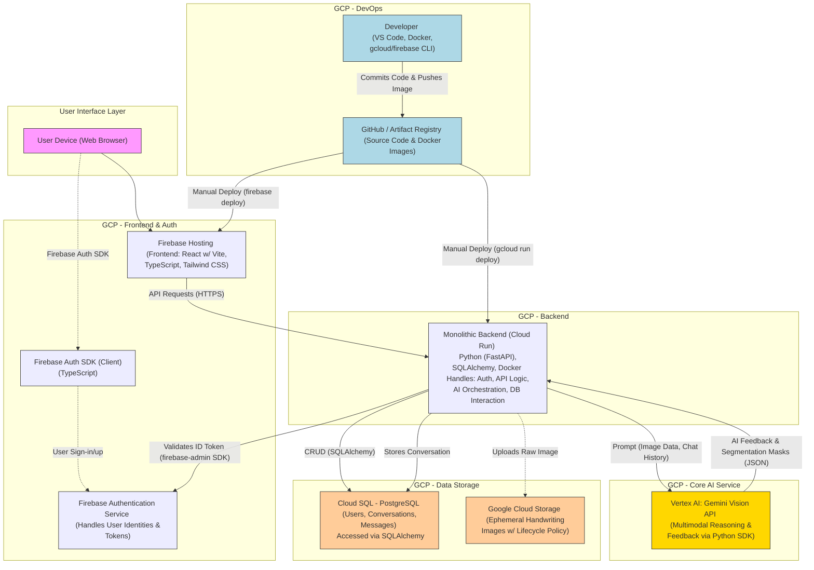

# LiveSolve: AI Handwriting Analysis & Conversational Feedback

LiveSolve is an intelligent web application that transforms the learning process. It empowers users to improve their skills by submitting handwritten work on a digital canvas and receiving instant, insightful, and conversational feedback powered by multimodal AI.

The application moves beyond simple file uploads, offering a fluid on-screen drawing experience. Users can write out solutions, select specific areas for analysis, and engage in a dynamic conversation with an AI tutor that visually highlights errors and provides contextual explanations.

https://github.com/user-attachments/assets/d4686b93-8bfa-46a4-870c-f9c41085e8e4

---

## 📚 Table of Contents

-   [Features](#-features)
-   [System Architecture](#-system-architecture)
-   [Technology Stack](#-technology-stack)
-   [Local Development Setup](#-local-development-setup)
-   [Testing AI Functionality](#-testing-ai-functionality-without-database)
-   [Deployment Workflow](#-deployment-workflow)
-   [Project Structure](#-project-structure)
-   [API Documentation](#-api-documentation)
-   [Troubleshooting](#-troubleshooting)

---

## 🎯 Features

-   **AI-Powered Analysis** - Uses Google Gemini for intelligent error detection.
-   **Visual Feedback** - Bounding boxes and segmentation masks highlight errors directly on the user's handwriting.
-   **Interactive Digital Canvas** - A fluid, on-screen handwriting interface with tools like a pen, eraser, and undo functionality.
-   **Conversational Learning** - A stateful chat interface for users to ask follow-up questions and discuss feedback.
-   **Testing Mode** - Test core AI functionality without requiring a database connection.
-   **Secure Authentication** - User accounts and data are protected using Firebase Authentication.
-   **Cloud-Native** - Built on a scalable, serverless Google Cloud and Firebase backend.

---

## 🏗️ System Architecture

The application is built on a modern, serverless architecture leveraging Google Cloud Platform. The React frontend is served by Firebase Hosting and communicates with a containerized FastAPI backend on Cloud Run, which orchestrates AI analysis and data persistence.



---

## 💻 Technology Stack

| Category             | Technology / Service                                                              |
| -------------------- | --------------------------------------------------------------------------------- |
| **Frontend**         | React, TypeScript, Vite, Tailwind CSS, React-Router, `react-sketch-canvas`        |
| **Backend**          | Python, FastAPI, SQLAlchemy, Pydantic, Uvicorn                                    |
| **Database**         | Google Cloud SQL (PostgreSQL)                                                     |
| **AI / ML**          | Google Vertex AI (Gemini Vision API)                                              |
| **Hosting**          | Firebase Hosting (Frontend), Google Cloud Run (Backend)                           |
| **Authentication**   | Firebase Authentication                                                           |
| **Storage**          | Google Cloud Storage, Google Artifact Registry (for Docker)                       |
| **DevOps & Tools**   | Docker, Conda, Node.js, `gcloud` CLI, `firebase-tools` CLI                        |

---

## 🛠️ Local Development Setup

### Prerequisites
Before you begin, ensure the following tools are installed and configured:
-   **Google Cloud SDK (`gcloud` CLI):** Authenticated (`gcloud auth login`) and configured (`gcloud config set project fleet-automata-460507-p5`).
-   **Docker Desktop:** For building and running containerized applications.
-   **Node.js (LTS version):** The runtime for the frontend application.
-   **Conda:** For managing the Python environment for the backend.
-   **Firebase CLI (`firebase-tools`):** For deploying the frontend (`firebase login`).
-   **Cloud SQL Auth Proxy:** Must be installed and available in your system's PATH.

### 1. Backend Setup
```bash
# Navigate to backend directory
cd backend

# Create and activate conda environment
conda create -n livesolve_backend_env python=3.9
conda activate livesolve_backend_env

# Install dependencies
pip install -r requirements.txt

# Set up environment variables for local development
# Create a file named .env in the backend/ directory
# and populate it with the content below, adjusting if necessary.
```
**`backend/.env` content:**
```
GCP_PROJECT_ID="fleet-automata-460507-p5"
GCS_BUCKET_NAME="livesolve-mvp-images"
GCP_REGION="asia-southeast1"
AI_REGION="us-central1"
DB_USER="user"
DB_PASSWORD="1111"
DB_NAME="livesolve_app_db"
DB_HOST="127.0.0.1" # Points to the Cloud SQL Proxy
DB_PORT=5432
FIREBASE_PROJECT_ID="fleet-automata-460507-p5"
# Add GOOGLE_APPLICATION_CREDENTIALS pointing to your service account key json
```

### 2. Frontend Setup
```bash
# Navigate to frontend directory (from project root)
cd frontend

# Install dependencies
npm install

# Set up environment variables for local development
# Create a file named .env.local in the frontend/ directory
# and populate it with the following line:
```
**`frontend/.env.local` content:**
```
VITE_API_BASE_URL="http://127.0.0.1:8000"
```

### 3. Running the Application (The Three-Terminal Tango)
To work on the project, run three separate processes simultaneously in three terminals.

#### **Terminal 1: Start the Database Connection**
This terminal creates a secure tunnel to the Cloud SQL database.
```bash
# This command is for v1 of the proxy. Leave this terminal running.
cloud_sql_proxy -instances=fleet-automata-460507-p5:asia-southeast1:livesolve-postgres-mvp=tcp:5432
```

#### **Terminal 2: Start the Backend Server**
```bash
# Navigate to backend/
cd backend
conda activate livesolve_backend_env
uvicorn app.main:app --reload --port 8000
```
The backend API will be available at `http://localhost:8000` and docs at `http://localhost:8000/docs`.

#### **Terminal 3: Start the Frontend Server**
```bash
# Navigate to frontend/
cd frontend
npm run dev
```
The app will be available at `http://localhost:5173`.

---

## 🧪 Testing AI Functionality (Without Database)

The app includes a **Testing Mode** that allows you to test AI functionality without requiring a database setup.

### Features:
-   ✅ **AI Analysis** - Full error detection and feedback
-   ✅ **Bounding Box Detection** - Visual error highlighting
-   ✅ **No Database Required** - Perfect for quick AI testing
-   ✅ **Easy Mode Switching** - Toggle between testing and production

### How to Use Testing Mode:

1.  **Start the app** (follow the setup steps above).
2.  **Log in** with your Firebase account.
3.  Click the AI button (bottom right) to open the chat/control panel.
4.  The **"🧪 Test"** mode is active by default.
5.  Draw math work on the canvas.
6.  Click **"Select all work"** to get AI feedback using the test endpoint.
7.  You can toggle between modes using the **🧪 Test / 🚀 Live** button.

### Testing Mode vs Production Mode:

| Feature          | 🧪 Testing Mode                     | 🚀 Production (Live) Mode                  |
| ---------------- | ----------------------------------- | ------------------------------------------ |
| **AI Analysis**  | ✅                                  | ✅                                         |
| **Bounding Box** | ✅                                  | ✅                                         |
| **DB Storage**   | ❌                                  | ✅ (Saves conversation and submission)     |
| **GCS Upload**   | ✅                                  | ✅                                         |
| **Endpoint**     | `/api/v1/ai/test-feedback`          | `/api/v1/submission/submit/solution`       |

---

## 🚀 Deployment Workflow

Deployment is a manual, script-driven process to ensure consistency.

### **Backend Deployment (to Cloud Run)**

The `deploy_backend.sh` script is the **only** authorized method for deploying the backend.

**Step 0: Pre-Deployment Version Check**
Before building, list existing image tags to determine the next version number.```bash
gcloud artifacts docker images list asia-southeast1-docker.pkg.dev/fleet-automata-460507-p5/livesolve-repo --include-tags --filter='IMAGE ~ "backend-api$"'
```

**Step 1: Build Docker Image**
From the `backend/` directory, build the new image.
> ⚠️ **CRITICAL FOR APPLE SILICON (M1/M2/M3) MACS:** You **MUST** use the `--platform linux/amd64` flag.
```bash
# Replace X.X.X with your new version tag.
docker build --platform linux/amd64 -t asia-southeast1-docker.pkg.dev/fleet-automata-460507-p5/livesolve-repo/backend-api:X.X.X .
```

**Step 2: Push Image to Artifact Registry**
```bash
docker push asia-southeast1-docker.pkg.dev/fleet-automata-460507-p5/livesolve-repo/backend-api:X.X.X
```

**Step 3: Deploy to Cloud Run**
1.  Open `backend/deploy_backend.sh` and update the `IMAGE_TAG` variable.
2.  Ensure `backend/.deploy.env` exists and contains the correct `DEPLOY_DB_PASSWORD`.
3.  From the `backend/` directory, execute the script:
    ```bash
    ./deploy_backend.sh
    ```

### **Frontend Deployment (to Firebase Hosting)**
From the `frontend/` directory:
```bash
# 1. Build the application for production
npm run build

# 2. Deploy the built files to Firebase Hosting
firebase deploy --only hosting
```

## 📂 Project Structure
```
livesolve/
├── backend/                 # FastAPI backend
│   ├── app/
│   │   ├── api/v1/         # API endpoints
│   │   ├── core/           # Configuration and security
│   │   ├── db/             # Database models and CRUD
│   │   ├── services/       # AI and GCS services
│   │   └── schemas/        # Pydantic models
│   ├── requirements.txt    # Python dependencies
│   └── Dockerfile          # Container configuration
├── frontend/                # React + TypeScript frontend
│   ├── src/
│   │   ├── components/     # React components
│   │   ├── services/       # API service layer
│   │   ├── contexts/       # React contexts
│   │   └── pages/          # Page components
│   ├── package.json        # Node dependencies
│   └── vite.config.ts      # Vite configuration
└── README.md                # This file
```

---

## 📚 API Documentation

API documentation is auto-generated by FastAPI and available locally. Once the backend server is running, visit **[http://localhost:8000/docs](http://localhost:8000/docs)** for a full, interactive API specification.

### Key Endpoints

#### Testing Endpoints (No Database)
*   `POST /api/v1/ai/test-feedback`: Accepts an image file and returns AI analysis and bounding boxes without saving to the database.

#### Production Endpoints
*   `POST /api/v1/submission/submit/solution`: The main endpoint that accepts an image file, orchestrates the full AI pipeline, and saves the submission and feedback to the database.

---

## 🔧 Troubleshooting

#### "uvicorn: command not found"
-   Ensure your conda environment is activated: `conda activate livesolve_backend_env`.
-   If missing, install it: `pip install uvicorn`.

#### "ModuleNotFoundError: No module named 'fastapi'"
-   Ensure you have installed the backend dependencies: `pip install -r requirements.txt`.

#### Firebase authentication issues
-   Check your Firebase configuration in `frontend/src/firebaseConfig.ts`.
-   Verify that all `VITE_FIREBASE_*` environment variables are correct in your `frontend/.env` file.

#### GCS upload failures
-   Verify the `GOOGLE_APPLICATION_CREDENTIALS` path in `backend/.env` is correct.
-   Ensure the service account has the `Storage Admin` or `Storage Object Creator` IAM role for the bucket.
